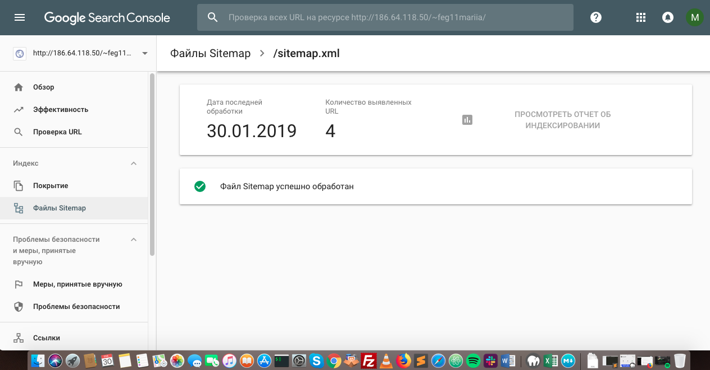
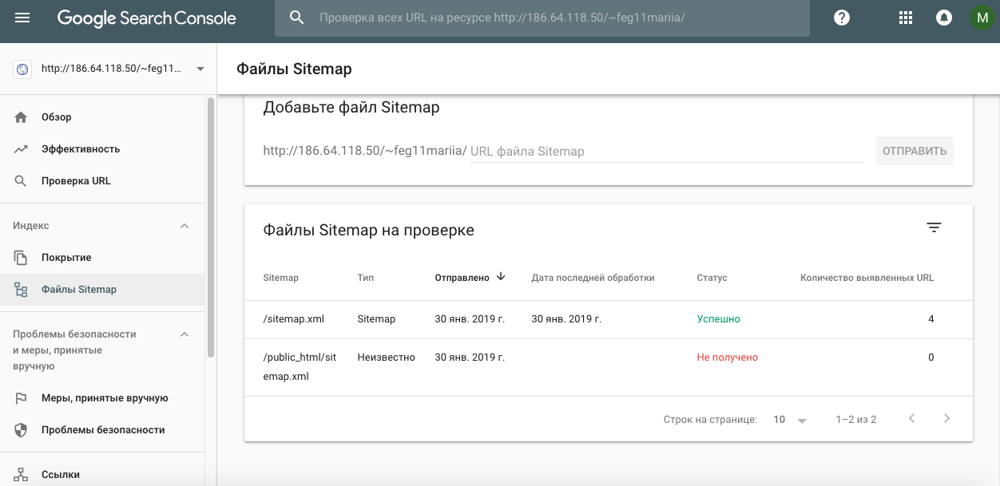

###URL del sitio web en producción
[link al sitio Kleaner](http://186.64.118.50/~feg11mariia/)

###Screenshot de la integración de Google Search Console con el sitio web
 [integracion a Google Search Console](img/captura.png)
 

###URL del sitemap creado
[sitemap](http://186.64.118.50/~feg11mariia/sitemap.xml)

###Screenshot de la integración con Google Search Console

###Listado con los aspectos de seguridad que optimizaste dentro de la página web:
   - Revisar si Wordpress está actualizado
   - Claves y permisos de usuario
   - El rol del hosting en la seguridad de Wordpress
   - Instalar plugin de seguridad(Wordfense)
	

